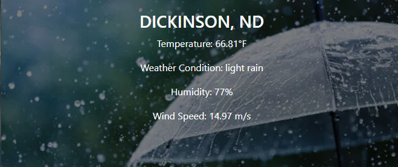
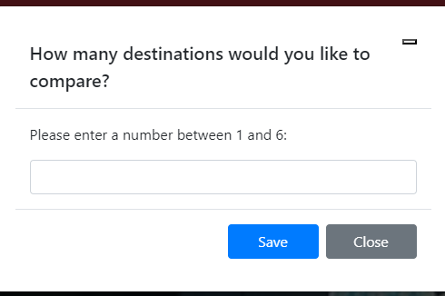
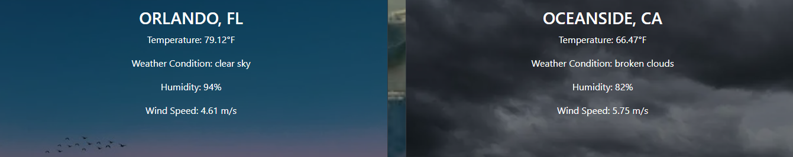

Project1 - ResortRadar


Have you ever wanted to plan a vacation but didnt know what the weather would be like? Torn between two vacation spots? Look no further, this website will have a user enter a destination, it will then display the Temperature, Weather Condition, Humity and Windspeed. When the page loads it will ask you how many destinations you would like to compare. You can select up to 6. You can then enter the City and State, click Get Weather and the weather card will display on the screen. Once you have your comparisons you can then click Reset button on the bottom of page and it will ask if you want to reset stored data. 

## Weather Comparison Webpage
This project aims to create a webpage that allows users to retrieve weather information for a specific location and compare it with another location.

## Acceptance Criteria
```md
GIVEN  ResortRador app, for finding weather where I want to travel to
WHEN I load the app
THEN I am presented with a modal asking how many destinations I want to compare to
WHEN I enter a number, between 1 and 6, I click Save
THEN I am presented with the landing page containing a form with labels and inputs for location.
WHEN I try to submit a form without a valid destination or incomplete data,
THEN I am presented with a message that prompts me to select a valid location.
WHEN I submit the form,
THEN the weather data is loaded from API and is stored to localStorage.
WHEN The weather data is also displayed on a card and the background image of the card will change depending on the weather,
i.e Sunny, CLoudy, Rain, Snow.
THEN I keep selecting destinations, it will display as many weather cards as I previously entered 
WHEN I am done viewing my choices
THEN I can click the Reset button on the bottom of the page
WHEN the button is clicked it will ask me if i want to clear to clear previous searched,
THEN I select Yes or No
WHEN I select YES, all the data is cleared
THEN I can start over.
WHEN I select NO,
THEN I can continue selecting locations.
WHEN I am done I can now choose where I want to travel to, knowing the weather

```


### Features

- **Location Input**: Users can enter a destination to retrieve weather information.
- **Weather Display**: The webpage will display the current weather conditions for the entered location.
- **Comparison**: Users will have the option to enter a second location and compare its weather with the first location.
! **Interface**: The page loades with a scenic background and text input for city and state. When click Get Weather, it will also display the current weather of the location entered 
by the user on a card and the weather type will be displayed as the card background. 
- **Reset button**: The bottom (or top) of the page will have a reset button to clear all save data.
- **User-friendly Interface**: The webpage will have a clean and intuitive interface for easy navigation.









### Getting Started

To run the webpage locally, follow these steps:

1. Clone the repository: `git clone https://github.com/mvoidets/ResortRadar`
2. Navigate to the project directory: `cd ResortRadar`
3. Install the necessary dependencies: `npm install`
4. Start the development server: `npm start`
5. Open your web browser and visit `https://mvoidets.github.io/ResortRadar/` to access the webpage.

### Technologies Used

- HTML
- CSS
- Bootstrap
- JavaScript
- React.js
- OpenWeatherMap API

### License


### Contributors
- andrewsoper1
- mvoidets

If you have any questions or suggestions, feel free to reach out to us at 
